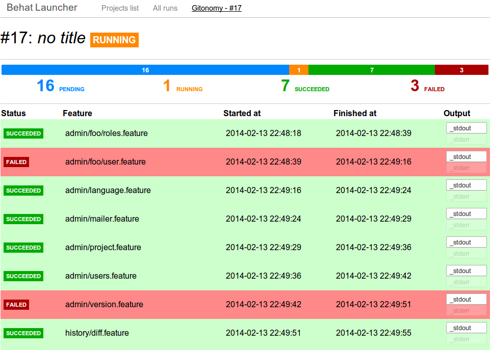

Behat Launcher
==============

|test_status| |last_version|

.. |test_status| image:: https://travis-ci.org/alexandresalome/behat-launcher.png
   :alt: Build status
   :target: https://travis-ci.org/alexandresalome/behat-launcher

.. |last_version| image:: https://poser.pugx.org/alexandresalome/behat-launcher/v/stable.png
   :alt: Latest stable version
   :target: https://packagist.org/packages/alexandresalome/behat-launcher

An application to **launch your Behat tests from your browser**:

Installation
------------

To install Behat-Launcher, you will need:

* PHP 5.5 (yeah, it's a project from the future)
* Apache2 or Nginx or anything that can run a PHP application
* A MySQL database
* NodeJS and npm to install Bower and Grunt

**1. Get the code**

Go to folder where you want to install Behat-Launcher and clone the sourcecode through git command:

.. code-block:: bash

    cd /var/www
    git clone git@github.com:alexandresalome/behat-launcher.git
    cd behat-launcher

**2. Install dependencies**

Behat-Launcher works with `composer <http://getcomposer.org>`_, a tool to manage dependencies.

Download it in behat-launcher folder:

.. code-block:: bash

    cd /var/www/behat-launcher
    curl http://getcomposer.org/installer | php
    php composer.phar install

This command will download dependencies in **vendor/** folder to make them available to the application.

Next you will need to install the assets using Bower and Grunt.

You can install these tools using npm, the NodeJS package manager:

.. code-block:: bash

    npm install -g bower
    npm install -g grunt-cli

You can now install the assets:

.. code-block:: bash

    bower install
    npm install
    grunt

**3. Configuration**

In this folder, create a file **config.php** where you will configure your database and your projects.

You can use the **config.php.dist** file to get an exhaustive list of configuration features.

.. code-block:: bash

    cd /var/www/behat-launcher
    cp config.php.dist config.php
    vi config.php # (or notepad, or whatever you use to edit this file)

**4. Database**

When you're done, initialize your database:

.. code-block:: bash

    php behat-launcher init-db

**5. WebServer**

Now, configure your web server to make the application accessible through your webserver. Make it serve the **web** folder:

.. code-block:: bash

    DocumentRoot /var/www/behat-launcher/web

Make sure web server has write access to *data/* folder.

**6. Background job**

To run tests, Behat-Launcher needs to run jobs in background. Start it using:

.. code-block:: bash

    cd /var/www/behat-launcher
    php behat-launcher run

This command will execute until you stop it. If you want command to stop after all units are ran, pass the **--stop-on-finish** option:

.. code-block:: bash

    cd /var/www/behat-launcher
    php behat-launcher run --stop-on-finish

You're done! Access your application through web server. Given you use Apache and only have this application set up, access http://localhost

Changelog
---------

**v0.1**

* Restart one test, all tests or failed only
* Run multiple tests concurrently
* Relaunch whole run or just failed, or stop execution
* Override behat.yml configuration values
* Record additional formats (html, failed, progress, ...)
* View output while process is running
