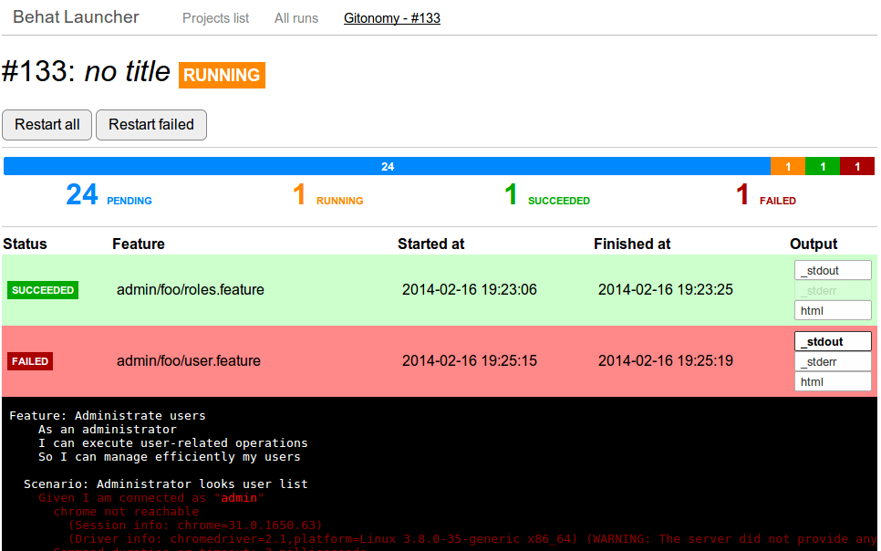

Behat Launcher
==============

|test_status| |last_version|

.. |test_status| image:: https://travis-ci.org/alexandresalome/behat-launcher.png
   :alt: Build status
   :target: https://travis-ci.org/alexandresalome/behat-launcher

.. |last_version| image:: https://poser.pugx.org/alexandresalome/behat-launcher/v/stable.png
   :alt: Latest stable version
   :target: https://packagist.org/packages/alexandresalome/behat-launcher

An application to **launch your Behat tests from your browser**:

Installation
------------

Clone or download code, install dependencies and create a **config.php** file.

Initialize database:

.. code-block:: bash

    php behat-launcher init-db

Usage
-----

Launch background jobs:

.. code-block:: bash

    php behat-launcher run

Access ``http://localhost/`` and make tests.

Changelog
---------

**v0.1**

* First release
* Relaunch whole run or just failed
* Override Behat parameters

Roadmap
-------

**v0.1**

* Popin for output files
* Configure expected output formats

**Unplanned**

* Relaunch one unit
* Duplicate a run
* Automatic refresh of the page

